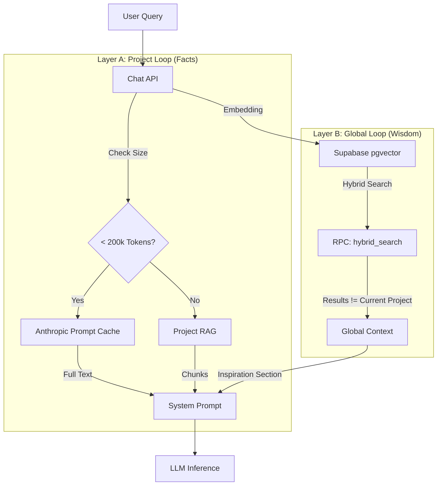

# Bobo AI - Double-Loop Architecture Spec

**Status:** Approved
**Implemented In:** Milestone 2
**Reference:** Research/Memory and context/Technical Memo.md

---

## 1. The Core Philosophy
We treat Context as two distinct streams:
1.  **The Project Loop (High Fidelity):** "The Truth." Full documents pinned in memory. Used for execution.
2.  **The Global Loop (Associative):** "The Wisdom." Snippets from past projects. Used for pattern matching and inspiration.

## 2. Architecture Diagram



## 3. The System Prompt Structure

The system prompt must strictly enforce the separation of these two loops to prevent hallucinations or data leaks.

```text
You are Bobo, an intelligent Second Brain.

### 1. ACTIVE PROJECT CONTEXT (Authoritative)
The user is currently working on: {{project_name}}
The following information is the GROUND TRUTH for this project.
<project_context>
{{full_project_files_or_chunks}}
</project_context>
INSTRUCTION: Use these details for all specific names, dates, code, and deliverables.

### 2. RELEVANT MEMORY & ASSOCIATIONS (Inspiration)
The following information is from the user's PAST WORK.
<global_context>
{{global_retrieved_chunks}}
</global_context>
INSTRUCTION: These are for INSPIRATION and PATTERN MATCHING only.
- If the user asks for a strategy, look here for what worked before.
- If the user is writing content, look here for connecting ideas.
- WARNING: Do NOT use names, specific IDs, or confidential data points from this section unless explicitly asked to cross-reference.
```

## 4. Database Implementation

### 4.1 Vector Store
We utilize `pgvector` on the `project_files` and `messages` tables.

```sql
-- Enable extension
create extension if not exists vector;

-- Add embedding columns
alter table project_files add column embedding vector(1536);
alter table messages add column embedding vector(1536);

-- Create search index
create index on project_files using ivfflat (embedding vector_cosine_ops);
```

### 4.2 The `hybrid_search` Function

```sql
create or replace function hybrid_search (
  query_embedding vector(1536),
  match_threshold float,
  match_count int,
  active_project_id uuid
)
returns table (
  id uuid,
  content text,
  similarity float,
  source_type text -- 'project' or 'global'
)
language plpgsql
as $$
begin
  return query
  select
    id,
    content,
    1 - (embedding <=> query_embedding) as similarity,
    case
      when project_id = active_project_id then 'project'
      else 'global'
    end as source_type
  from (
    select id, content, embedding, project_id from project_files
    union all
    select id, content->>'text' as content, embedding, project_id from messages
  ) as documents
  where 1 - (embedding <=> query_embedding) > match_threshold
  order by
    (case when project_id = active_project_id then 1 else 0 end) desc, -- Priority to current project
    similarity desc
  limit match_count;
end;
$$;
```

## 5. Implementation Strategy

### Phase 1: Caching (The Project Loop)
*   **Action:** Update `app/api/chat/route.ts`
*   **Philosophy:** "Project as a Lens." We treat the active project's files as the "Working Memory" for the AI.
*   **Logic:**
    *   Fetch all `project_files` for current `projectId`.
    *   Calculate total tokens.
    *   **If model supports caching (Anthropic, Gemini):**
        *   Use provider-specific caching API (headers for Anthropic, cached content for Gemini).
        *   "Pin" the full project context.
    *   **Else (OpenAI, etc.):**
        *   Inject full project context into System Prompt (up to context limit).
        *   This ensures the "Double-Loop" experience is consistent across all models, even if underlying mechanics differ.

### Phase 2: Embeddings (The Global Loop)
*   **Action:** Create embedding pipeline.
*   **Logic:**
    *   When file uploaded -> Generate embedding -> Save to DB.
    *   When message sent -> Generate embedding -> Save to DB.

### Phase 3: Retrieval (Closing the Loop)
*   **Action:** Update `app/api/chat/route.ts`
*   **Logic:**
    *   On new message, generate query embedding.
    *   Call `hybrid_search`.
    *   Inject "Global Context" section into prompt.
